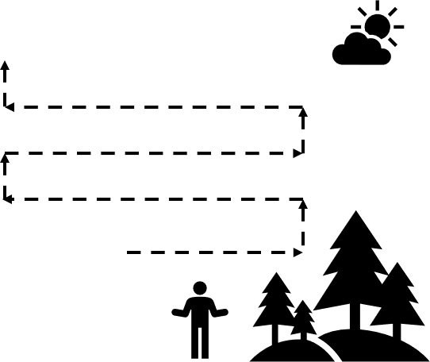

# Flight Operations in Heavily Trafficked Airspace{#ch-see_avoid}

## Planning

- Ensure you always have clear visibility to the horizon
- Pre-plan how you might address in-coming aerial threats

    - Identify contingency landing locations
    - Identify potential escape routes or emergency options

- Keep your aviation radio knowledge up-to-date and in-practice


## In-Flight Risk Management

- Be Alert for Incoming Aerial Threats

    - Scan the horizon and listen for incoming aerial threats
    - Most of the time, aerial threats will be heard before they are seen
    - However, do not rely on audio queues alone

- Scanning the Horizon (Figure~\@ref(fig:scanning))

    - Start at the bottom-right or bottom-left
    - Sweep back and forth
    - After each sweep, look slightly higher and sweep back

```{r scanning, fig.cap='Scanning for Air Traffic', out.width='75%', fig.asp=.75, fig.align='center', echo=FALSE}

```

- Avoid Empty Field Myopia

    - Look and focus on objects in the distance occasionally
    - Avoid staring into the sky or clouds for too long
    - Occasionally use peripheral vision to detect motion in the sky

- Be Prepared for Emergency Actions

    - Always be ready to initiate a stop or failsafe command
    - Be aware of your surroundings and have escape routes planned out

