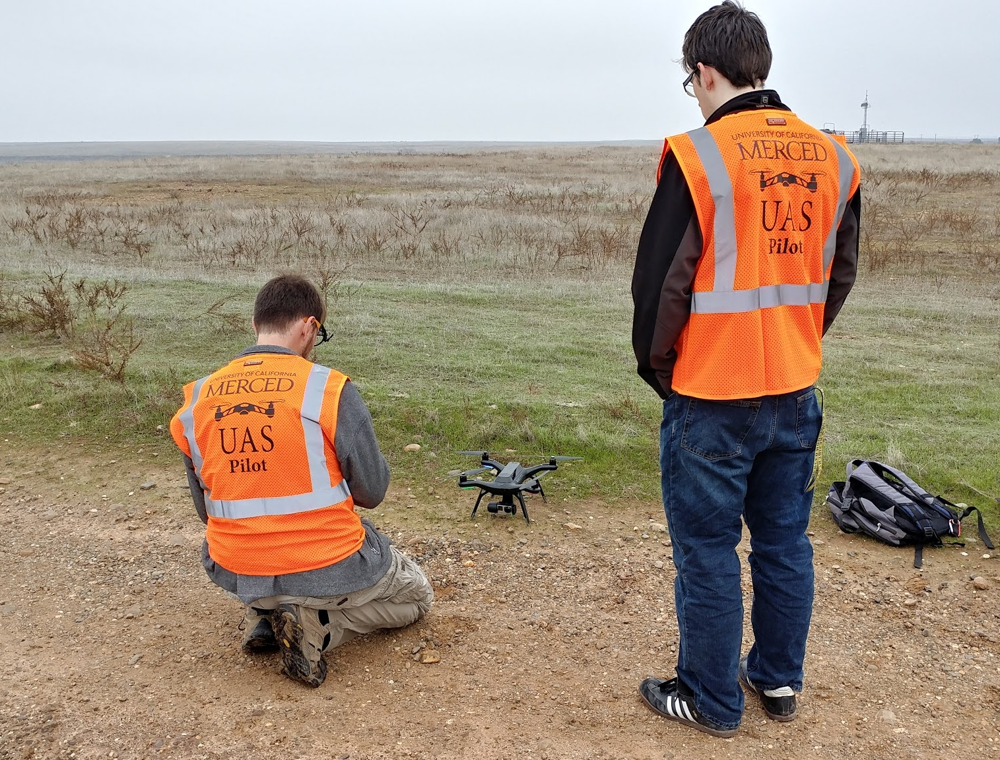

# (PART) UC Operating Standards {-}

# Standard Guidance

- All UAS activity must establish a buffer or safe-zone between the Unmanned Aircraft and any non-participating persons or sensitive locations.
    - A good rule-of-thumb is to maintain a buffer or safe-zone of roughly $\frac{1}{4}^{th}$ of the flight altitude.
- Visual Observers and supporting ground crew should be utilized when available.
    - Supporting ground crew should assist in ensuring safety to all non-participating persons.
- All members of the flight crew must be conspicuous and wear professional, identifying apparel such as university-branded hats, shirts or lanyards with IDs.
- High visibility reflective vests must be worn when operating near roads or in parking lots.  
- When operating in fenced areas, operate exclusively within the fenced areas unless there is sufficient visibility on the other side to ensure safety to non-participants.

```{r hivis, fig.cap='UAS operators with high visiblity vests, UC Merced', out.width='75%', fig.asp=.75, fig.align='center', echo=FALSE}

```

## Operating on Campus or other busy locations

- Utilize the UC UAS Mission Planning Template (link) to systematically develop your flight plan
- When operating in uncontrolled locations in proximity to non-participating persons, extra care should be exercised. Specific flight paths and altitudes should be pre-planned such that potential gaps in buffer or safe-zones can be identified.
- High visibility vests are recommended, but not required when near nonparticipants or in public areas
- Orange cones may be used to help communicate Unmanned Aircraft flight regions to non-participating persons, but are not fully sufficient.
    - Supplement any portable pedestrian control equipment (cones, caution tape, signs) with ground personnel
- If spectators are expected, a supporting ground crew member should be tasked with preventing spectators from distracting the RPIC with questions or comments.
- When operating near roads, a supporting ground crew member should be tasked with being located near the road to monitor traffic, and if necessary, retrieve a fallen Unmanned Aircraft before it becomes a road hazard.
- Flying above buildings and structures minimizes risk to pedestrians, but it is recommended to contact the facility manager to explain the proposed operation and potential for risk.

